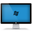

<p align="center">
  
</p>

<h1 align="center">Show Desktop</h1>

<p align="center">
  <a href="https://github.com/sgolby/ShowDesktop/releases/latest"></a>
  <a href="https://github.com/sgolby/ShowDesktop"></a>
  <a href="https://dotnet.microsoft.com/download/dotnet/8.0"></a>
  <a href="LICENSE"></a>
</p>

A tiny Windows utility that shows the desktop. Run it once to minimize all windows; run it again to restore them.

## The Problem

1. Don't have a keyboard on your lounge room gaming PC to press Win+D to get to the desktop? 🎮
2. Too many icons on your taskbar, so you can't even find a spot to right click and 'Show Desktop'? 🖥️


This utility solves 2 of my annoying problems, retro PC has a joystick to mouse input but no easy way to get to the desktop, or flip back to Emulation Station DE without getting up and grabbing a keyboard. My desktop PC has a long row of Taskbar icons and I've run out of room to right click and Show Desktop. (it's also a complete pain doing the right click and hold while on my TV PC)

## Download

Grab the latest `ShowDesktop.exe` from the [Releases](https://github.com/sgolby/ShowDesktop/releases/latest) page. No installer, no dependencies - just run it.

## FAQ

**The build size is absurd!**
</br>Yep.
</br>That's the joy of .NET.   On a modern PC this is just one disk 'seek' and the util will be in memory and run nearly instantly afterwards.

**I could just press Win+D!**
<br>Yep.
<br>Good luck doing that on a PC without a keyboard. (that's the whole point of this utility)

**Will my antivirus flag it?**
</br>Possibly. The tiny AOT build does get flagged on some systems.
</br>The app also uses `keybd_event` to simulate keypresses, which some heuristic scanners treat as suspicious. It contains no malicious code - build it yourself from the source here to verify.


## Build from source

Requires the [.NET 8 SDK](https://dotnet.microsoft.com/download/dotnet/8.0).

```
dotnet build ShowDesktop.csproj
```

### Build configurations

| Configuration | Description |
|---|---|
| `Debug` | Standard debug build |
| `Release` | Self-contained single-file `.exe` for `win-x64` |
| `SmallRelease` | Same as Release but with trimming enabled (smaller file) |
| `Tiny` | AOT-compiled (smallest possible, no .NET runtime needed) |

To publish a self-contained release build:

```
dotnet publish ShowDesktop.csproj -c Release
```


## Other Projects

Check out my other projects:

<table>
  <tr>
    <td align="center">
      <a href="https://www.actuallyinteracting.com/">
        
      </a>
      <br />
      <a href="https://www.actuallyinteracting.com/">IRL - Actually Interacting</a>
    </td>
    <td align="center">
      <a href="https://www.appbite.com/">
        
      </a>
      <br />
      <a href="https://www.appbite.com/">Appbite</a>
    </td>
    <td align="center">
      <a href="https://www.appbite.com/apps/hext/">
        
      </a>
      <br />
      <a href="https://www.appbite.com/apps/hext/">HexT - Puzzle Game</a>
    </td>
  </tr>
</table>

## License

MIT — see [LICENSE](LICENSE).
